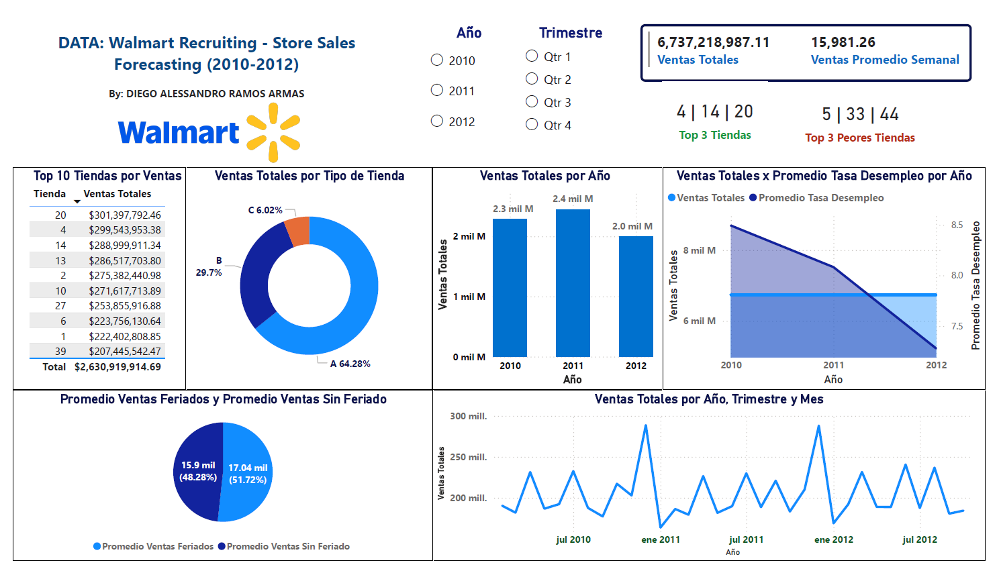

# 📊 Walmart Sales Forecasting Dashboard — Power BI

**Autor:** Diego Alessandro Ramos Armas  
**Año:** 2026  
**Herramientas:** Power BI Desktop | DAX | Power Query | Google Sheets

---

## 📌 Descripción

Dashboard interactivo desarrollado en Power BI con datos históricos de ventas 
de 45 tiendas Walmart distribuidas en diferentes regiones de EE.UU. (2010-2012).

El objetivo es analizar el comportamiento de las ventas semanales, identificar 
tendencias, comparar el rendimiento por tipo de tienda y evaluar el impacto de 
factores externos como el desempleo y los feriados.

---

## 📁 Dataset

- **Fuente:** [Kaggle — Walmart Recruiting Store Sales Forecasting](https://www.kaggle.com/competitions/walmart-recruiting-store-sales-forecasting)
- **Registros:** 421,570 filas de ventas semanales
- **Período:** Febrero 2010 — Noviembre 2012
- **Tablas utilizadas:** `train.csv`, `stores.csv`, `features.csv`
- **Conexión:** Google Sheets (nube pública)

---

## 📊 Vista Previa



---

## 🔍 KPIs y Análisis incluidos

- 💰 Ventas Totales y Promedio Semanal
- 🏆 Top 3 Tiendas con más ventas
- 📉 Top 3 Tiendas con menos ventas
- 🏪 Ventas por Tipo de Tienda (A, B, C)
- 📈 Tendencia de Ventas Semanales 2010-2012
- 📉 Impacto del Desempleo en las Ventas
- 🎄 Comparativo Feriados vs Días Normales
- 🗓️ Ventas por Año y Trimestre

---

## 🛠️ Transformaciones realizadas

- Cambio de nombres de columnas a español
- Conversión de tipos de datos en Power Query
- Manejo de valores nulos en columnas MarkDown
- Creación de medidas DAX personalizadas
- Conexión a fuente de datos en la nube vía Google Sheets

---

## 📐 Medidas DAX creadas

```dax
Ventas Totales = SUM(train[Ventas_Semanales])

Ventas Promedio Semanal = AVERAGE(train[Ventas_Semanales])

Top 3 Tiendas = 
VAR Ranking = TOPN(3, ALL(train[Tienda]), [Ventas Totales], DESC)
RETURN CONCATENATEX(Ranking, train[Tienda], " | ", train[Tienda], ASC)

Promedio Ventas Feriados = 
CALCULATE(AVERAGE(train[Ventas_Semanales]), train[Es_Feriado] = TRUE())

Promedio Ventas Sin Feriado = 
CALCULATE(AVERAGE(train[Ventas_Semanales]), train[Es_Feriado] = FALSE())
```

---

## 📂 Archivos del repositorio

| Archivo | Descripción |
|---|---|
| `DashboardDataWalmart_Diego_Alessandro_Ramos_Armas_2026.pbix` | Archivo Power BI |
| `Data Walmart 45 tiendas - by Diego Ramos Armas.png` | Captura del dashboard |

---

## 👤 Autor

**Diego Alessandro Ramos Armas**  
Bachiller en Ingeniería Informática — Universidad Nacional de Trujillo  
📧 diegoramosarmas982@gmail.com  
🔗 [LinkedIn](https://www.linkedin.com/in/diegoramosarmas)  
🐙 [GitHub](https://github.com/diegora16)
